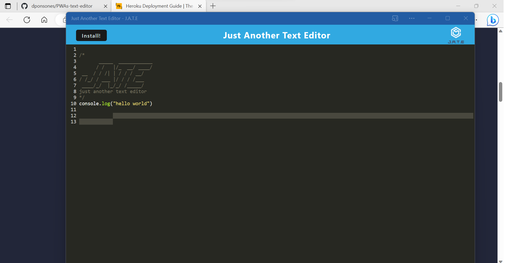
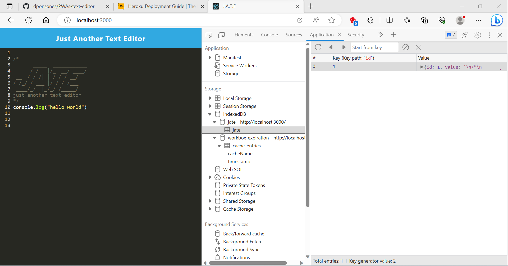
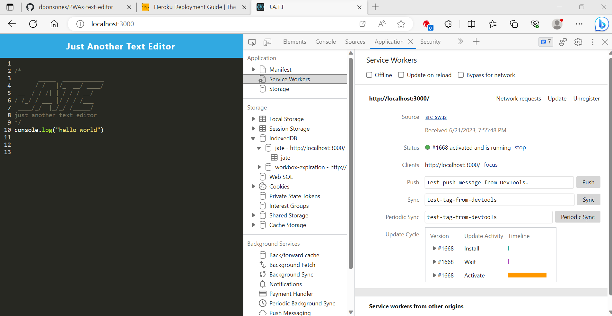

# 19 Progressive Web Applications (PWA): Text Editor

## Task

This project focused on building a text editor that runs in the browser. The app is a single-page application that meets the PWA criteria. Additionally, features a number of data persistence techniques that serve as redundancy in case one of the options is not supported by the browser. The application also functions offline.

## User Story


## To get started
1. Run
```
npm run start
```

The following animation demonstrates the application functionality:



The following image shows the application's IndexedDB storage:



The following image shows the application's registered service worker:




## Links

You are required to submit the following for review:

* The URL of the deployed application

* The URL of the GitHub repository, with a unique name and a README describing the project

- - -
© 2023 edX Boot Camps LLC. Confidential and Proprietary. All Rights Reserved.
